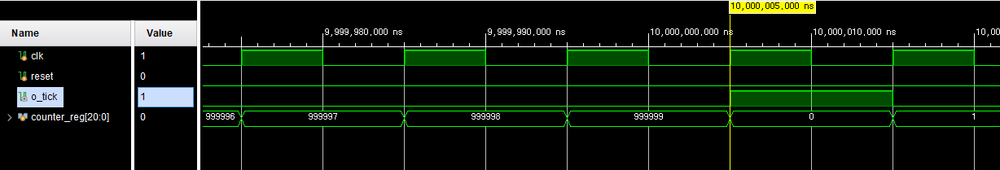
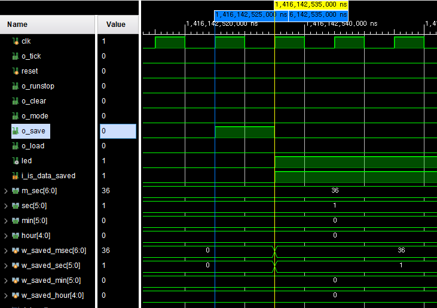
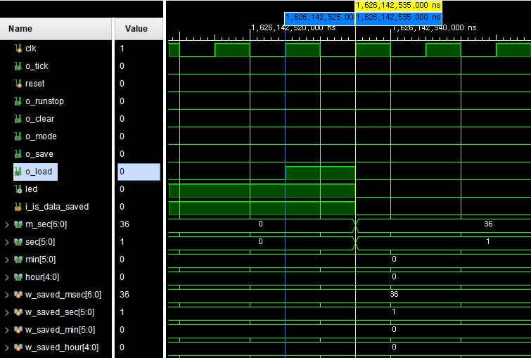
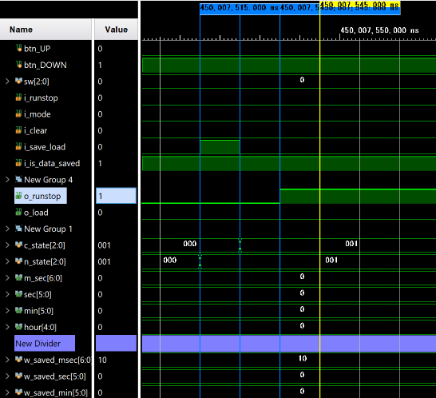
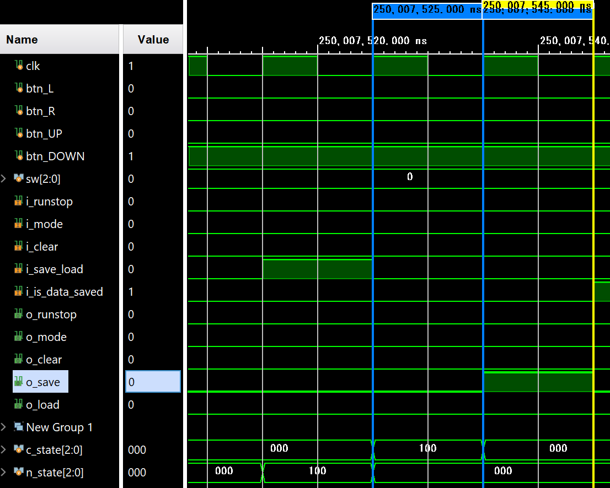

# FPGA Dual-Mode Stopwatch & Watch


-green)

> **Summary (EN)** — A dual-mode stopwatch/clock system implemented in Verilog on a Xilinx Basys3 FPGA.
> A single 10 ms tick, derived by dividing the 100 MHz system clock by 1,000,000, drives a chain of
> parameterized counters (mod-100/60/60/24). Two independent datapaths — a stopwatch and a settable
> watch — share one debounced button set and one 4-digit FND display, selected at the top level by a
> switch. Every module follows a strict datapath / control-unit separation, and each control unit is a
> Moore FSM. Extra features include stopwatch **save/load** via snapshot registers, **12/24-hour**
> display conversion, and a **blinking indicator** on the digit currently being edited. All modules were
> verified in simulation and on hardware.

<!-- TODO: 보드 데모 GIF 삽입 -->
[](https://github.com/user-attachments/assets/8f231c7d-fc8c-4c3b-8f23-577ee3c64acf)

---

## 1. 개요

부트캠프 팀 프로젝트로, **스톱워치**와 **시계** 두 기능을 하나의 top module에 통합해 Basys3 보드에 구현했습니다.


- 100 MHz 클럭을 100만 분주한 **10 ms tick**을 모든 시간 계산의 기준으로 사용
- 파라미터화된 카운터 하나를 진법만 바꿔 재사용 → msec → sec → min → hour 자리올림 체인 구성
- **datapath / control unit 분리** — 데이터 조작·저장은 datapath, 상태 생성은 control unit이 전담
- 두 모드가 버튼 세트와 FND 표시부를 공유하고, `sw[1]`로 전환

| 항목 | 값 |
|---|---|
| 개발 환경 | Vivado 2020.2 |
| 타겟 보드 | Digilent Basys3 |
| 디바이스 | `xc7a35tcpg236-1` |
| 시스템 클럭 | 100 MHz (10 ns, `PACKAGE_PIN W5`) |
| 언어 | Verilog-2001 |

---

## 2. 기능

### 모드 및 추가기능

| 구분 | 기능 |
|---|---|
| Stopwatch | run/stop, clear, up/down 모드 전환, **save / load** |
| Watch | 시/분/초 자리 이동 및 up/down 조정, **12·24시간제 전환**, **조정 자리 점멸** |
| 공통 | 8자리 FND 시분할 표시, 50 ms 주기 DP 점멸, 버튼 디바운스 |

### 스위치 정의

| 스위치 | 0 | 1 |
|---|---|---|
| `sw[0]` | 초 : 밀리초 표시 | 시 : 분 표시 |
| `sw[1]` | 스톱워치 | 시계 |
| `sw[2]` | 24시간제 | 12시간제 *(시계 모드에서만)* |

### 버튼 정의

| 버튼 | Stopwatch | Watch |
|---|---|---|
| `btn_L` | run / stop | 반시계방향 자리 이동 |
| `btn_R` | clear | 시계방향 자리 이동 |
| `btn_UP` | mode (up / down 카운트) | 선택 자리 증가 |
| `btn_DOWN` | save / load | 선택 자리 감소 |
| `btn_C` | reset | reset |

---

## 3. 시스템 구조

### 최상위 블럭도


### 모듈 계층

```text
top_stopwatch                        ── 최상위 (통합)
│
├─ btn_debouncer ×4                  (L / R / UP / DOWN)
│
├─ [STOPWATCH 경로]
│   ├─ control_unit                  (STOP/RUN/CLEAR/MODE/SAVE/LOAD)
│   └─ stopwatch_datapath
│       ├─ tick_gen_100hz            (10 ms tick)
│       └─ time_counter ×4           (mod 100·60·60·24, load 지원)
│
├─ [WATCH 경로]
│   ├─ watch_control_unit            (START/HOUR/MIN/SEC FSM)
│   └─ watch_datapath
│       ├─ tick_gen_100hz            (재사용)
│       ├─ demux_1x3 ×2              (up/down → 선택 자리로 라우팅)
│       └─ watch_time_counter ×4     (up/down 조정, HOUR 초기값 12)
│
├─ 12/24시간제 변환 로직              (top 내 조합논리, sw[2])
│
└─ fnd_controller                    (표시부)
    ├─ clk_div(1 kHz) · counter_8 · decoder_2x4 · bcd
    ├─ digit_splitter ×4 · mux_8x1 ×2 · mux_2x1
    ├─ comparator_dot                (DP 50 ms 점멸)
    └─ state_decoder + indicator ×4  (조정 자리 점멸)
```

### 신호 흐름

```text
버튼 → [debounce] → (sw[1] 게이팅) ┬→ stopwatch: control_unit → stopwatch_datapath ┐
                                   └→ watch    : watch_control_unit → watch_datapath ┘
                                                                                     │
        sw[1] mux로 시간 데이터 선택 → (watch면 sw[2] 12/24 변환) → fnd_controller → FND
```

---

## 4. 설계 포인트

### 4-1. 파라미터 재사용 카운터

`time_counter #(COUNT_NUM)` 하나로 100·60·60·24진 카운터를 모두 인스턴스화합니다. 상위에서 진법을 주입하므로 자리마다 별도 모듈을 작성할 필요가 없고, 폭도 `$clog2(COUNT_NUM)`으로 자동 결정됩니다.

```verilog
time_counter #(.COUNT_NUM(60)) U_COUNTER_SEC (
    .clk(clk), .reset(reset), .i_tick(w_tick_sec),
    .mode(mode), .run_stop(runstop), .clear(clear),
    .load(load), .value(w_saved_sec),
    .time_cnt(sec), .o_tick(w_tick_min)
);
```

### 4-2. datapath / control unit 분리

control unit은 **상태만** 생성하고, 실제 데이터 조작·저장은 datapath가 담당합니다. save/load 분기는 datapath가 내보내는 `o_is_data_saved` 플래그를 control unit이 되먹임으로 받아 결정합니다.

- 저장 데이터 없음 + `btn_DOWN` → `SAVE`
- 저장 데이터 있음 + `btn_DOWN` → `LOAD`
- load 후 플래그가 0으로 돌아가 다시 save 가능

### 4-3. 버튼 게이팅으로 모드 공유

버튼 하나를 두 경로가 나눠 쓰기 위해 `& sw[1]` / `& !sw[1]`로 게이팅합니다. 두 datapath는 항상 병렬로 동작하며, 표시할 값만 mux로 고릅니다.

```verilog
assign w_sec  = (sw[1]) ? w_sec_watch  : w_sec_stopwatch;
assign w_hour = (sw[1]) ? w_hour_display_watch : w_hour_stopwatch;
```

### 4-4. 표시 직전 12/24시간제 변환

내부 hour 카운터는 항상 0~23으로 유지하고, **표시 직전 조합논리로만** 변환합니다. 카운터 상태를 건드리지 않으므로 모드를 오가도 시간이 틀어지지 않습니다.

### 4-5. FND 시분할

1 kHz로 자리 선택 카운터를 돌려 8자리를 빠르게 번갈아 켭니다. DP는 `msec < 50` 조건으로 50 ms 주기 점멸시켜 초 단위 진행을 시각화했습니다.

---

## 5. 검증

검증은 두 계층으로 나눠 진행했습니다. 리프 모듈과 watch datapath는 해당 모듈을 직접 DUT로 삼아 단독 검증했고, **control unit은 top에 통합한 뒤 `top_stopwatch`를 DUT로 두고 디바운스된 버튼을 자극으로 사용해 검증**했습니다. control unit의 입력이 디바운서 출력이므로, 실제 신호 폭과 타이밍을 반영하려면 top 레벨에서 자극을 주는 편이 정확하다고 판단했습니다. 대신 파형 관찰은 계층 내부 신호(`c_state`, `n_state`, `o_runstop` 등)를 대상으로 했습니다.

| 테스트벤치 | DUT | 관찰 대상 | 검증 시나리오 | 결과 |
|---|---|---|---|---|
| [`tb_tick_gen_100hz`](tb/tb_tick_gen_100hz.v) | `tick_gen_100hz` | `o_tick` | 999,999 clk 후 1펄스 발생, 주기 정확도 | Pass |
| [`tb_stopwatch_control_unit`](tb/tb_stopwatch_control_unit.v) | `top_stopwatch` | `control_unit` 내부 상태·출력 | 유효 천이(STOP↔RUN, MODE 토글) / 무효 입력(RUN 중 save) 무시 | Pass |
| [`tb_stopwatch_save_load`](tb/tb_stopwatch_save_load.v) | `top_stopwatch` | `stopwatch_datapath` 저장 레지스터, `led` | run → save → clear → load 시퀀스, `is_data_saved` 플래그 | Pass |
| [`tb_watch_control_unit`](tb/tb_watch_control_unit.v) | `top_stopwatch` | `state` | 정·역방향 4상태 순환 | Pass |
| [`tb_watch_datapath`](tb/tb_watch_datapath.v) | `watch_datapath` | `hour`/`min`/`sec` | state별 up/down이 해당 자리에만 반영되는지 | Pass |


**tick 생성 파형**



**save / load 파형** — 디바운스된 `btn_DOWN`의 하강 엣지에 save가 반영되고 `led`가 점등, load 시 저장값으로 복원되며 소등됩니다.



---

## 6. 트러블슈팅

### 6-1. 상태 인코딩 충돌 — 시뮬레이션을 통과하고 보드에서 터진 버그

**증상.** 시뮬레이션에서는 save/load가 정상 동작했으나, 보드에서는 `btn_DOWN`을 눌러도 저장·복원이 되지 않고 스톱워치가 run 상태로 진입했습니다.

**원인.** `control_unit`의 파라미터 선언에서 `LOAD`가 `RUN`과 같은 값을 갖고 있었습니다.

```verilog
// as-is
parameter STOP = 3'b000, RUN = 3'b001, CLEAR = 3'b010,
          MODE = 3'b011, SAVE = 3'b100, LOAD = 3'b001;  // RUN과 충돌
```

STOP에서 저장 데이터가 있는 상태로 down을 누르면 `n_state = LOAD(3'b001)`가 되고, 다음 posedge에 `case(c_state)`에서 **위에 있는 RUN 라벨이 먼저 매치**됩니다. LOAD 분기는 실행되지 않아 `o_load`가 발생하지 않고, down 버튼이 사실상 run 토글로 동작했습니다.

**시뮬레이션에서 놓친 이유.** `tb_stopwatch_save_load`가 control unit을 거치지 않고 datapath에 `save`/`load`를 **직접 인가**하는 구조였습니다. 단위 테스트벤치가 검증 대상 경로를 우회했기 때문에 control unit의 인코딩 충돌이 드러날 수 없었고, top 레벨 테스트에는 save/load 시나리오 자체가 없어 커버리지 공백이 남아 있었습니다.

**조치.** `LOAD = 3'b101`로 수정하고 보드에서 동작을 재검증했습니다. 아울러 각 기능이 상위 계층 테스트에서도 커버되는지 점검했습니다.

| 수정 전 | 수정 후 |
|---|---|
| |  |

### 6-2. `time_counter` 출력 tick이 지속 유지되는 버그

**증상.** 상위 자리 tick이 1로 유지되어 sec·min·hour가 매 clk마다 증가했습니다.

**원인.** `o_tick`을 0으로 내리는 분기가 `if(i_tick)` 블록 **내부**에만 존재했습니다.

**조치.** `i_tick`이 없는 경우에도 다음 posedge에 `o_tick`이 0으로 떨어지도록 `else`로 이동시켰습니다. 결과적으로 msec가 99 → 0이 되는 순간에만 sec가 1회 증가합니다.

### 6-3. 12시간제 변환 시 자정 표시 오류

**증상.** 12시간제로 전환하면 `00시`가 그대로 `00`으로 표시되었습니다.

**원인.** `hour - 12` 단순 뺄셈만 적용해 13~23시는 정상 변환되었으나, 0시를 12로 출력해야 하는 예외 조건이 누락되었습니다.

**조치.** `hour == 0` 조건을 별도 분기로 추가했습니다.

```verilog
always @(*) begin
    w_hour_display_watch = w_hour_watch;
    if (w_format12_watch) begin
        if (w_hour_watch > 12)      w_hour_display_watch = w_hour_watch - 12; // 13~23 -> 1~11
        else if (w_hour_watch == 0) w_hour_display_watch = 12;                // 0 -> 12
    end
end
```

---

## 7. 빌드 및 실행

### 요구 사항

- Xilinx Vivado 2020.2 이상
- Digilent Basys3 보드

### 절차

1. Vivado에서 RTL Project를 새로 생성하고 디바이스로 `xc7a35tcpg236-1`을 선택합니다.
2. `src/` 이하 `.v` 파일을 Design Sources로, `tb/` 이하 파일을 Simulation Sources로 추가합니다.
3. 제약 파일(`.xdc`)을 Constraints로 추가합니다. 시스템 클럭 제약은 다음과 같습니다.

   ```tcl
   set_property -dict { PACKAGE_PIN W5  IOSTANDARD LVCMOS33 } [get_ports clk]
   create_clock -add -name sys_clk_pin -period 10.00 -waveform {0 5} [get_ports clk]
   ```

4. Top module을 `top_stopwatch`로 지정합니다.
5. Run Synthesis → Run Implementation → Generate Bitstream 순으로 실행합니다.
6. 보드를 연결하고 Open Hardware Manager → Program Device로 비트스트림을 다운로드합니다.

### 핀 배치

| Pin | Port | 기능 |
|---|---|---|
| W5 | `clk` | 100 MHz 시스템 클럭 |
| U18 | `reset` (btnC) | reset |
| V17 | `sw[0]` | hh:mm ↔ ss:ms 표시 전환 |
| V16 | `sw[1]` | watch / stopwatch 전환 |
| W16 | `sw[2]` | 12 / 24시간제 전환 |
| W19 | `btn_L` | 자리 이동(좌) / run-stop |
| T17 | `btn_R` | 자리 이동(우) / clear |
| T18 | `btn_UP` | time up / mode |
| U17 | `btn_DOWN` | time down / save-load |
| W7, W6, U8, V8, U5, V5, U7, V7 | `fnd_data[7:0]` | FND 세그먼트 (V7 = DP) |
| U2, U4, V4, W4 | `fnd_com[3:0]` | FND 자리 선택 |
| U16 | `led` | save 상태 표시 |

기능 열은 `watch / stopwatch` 순서입니다. 세그먼트·애노드 핀은 연속 배치가 아니므로 Basys3 마스터 XDC의 순서를 그대로 따랐습니다.

### 시뮬레이션

Simulation Sources에서 원하는 테스트벤치를 top으로 지정한 뒤 Run Behavioral Simulation을 실행합니다. `tb_stopwatch_save_load`와 `tb_watch_and_stopwatch_top`은 실제 tick(10 ms) 단위로 시간을 진행시키므로 실행 시간이 깁니다.

---

## 8. 저장소 구조

```text
fpga_proj_watch_stopwatch/
├─ docs/      설계 노트 및 발표 자료
├─ images/    블럭도, FSM 상태도, 시뮬레이션 파형, 데모
├─ src/       RTL 소스 및 제약 파일
└─ tb/        테스트벤치
```

---

## 9. 역할 분담

| 담당 | [박정민](https://github.com/jeongmin-0113) | [방지윤](https://github.com/jy0917) |
|---|---|---|
| Watch | watch datapath (`demux_1x3`, `watch_time_counter`) | watch control unit (FSM) |
| 통합 | top module 통합 (`sw[1]` mux 및 게이팅) | — |
| 추가기능 | stopwatch save / load | 12↔24시간제 변환, 조정 자리 점멸 indicator |

---

## 10. 결과

- 스톱워치·시계 두 모드를 하나의 top에 통합, `sw`로 전환하며 동작 확인
- 추가기능 3종(save/load, 12/24시간제, 조정 자리 점멸) 모두 시뮬레이션 및 보드 검증 완료
- 상태 인코딩 충돌 버그를 계기로 단위 테스트벤치의 자극 주입 지점과 계층별 커버리지 점검 기준을 정립

- [설계 노트](docs/design_note.md) — 모듈별 소스코드, 전체 시뮬레이션 파형, 상세 설계 과정
- [발표 자료](docs/presentation.pdf) — 2026.08.03 프로젝트 발표